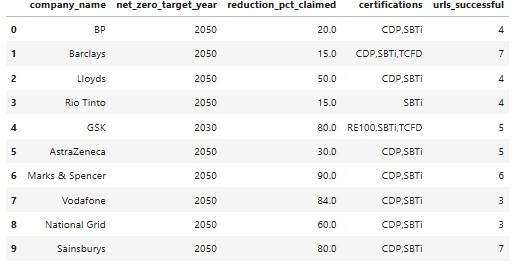
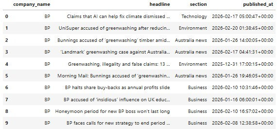
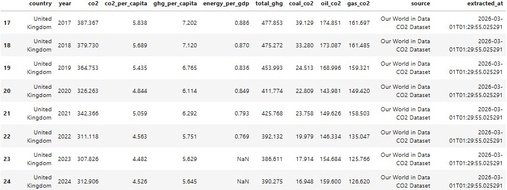
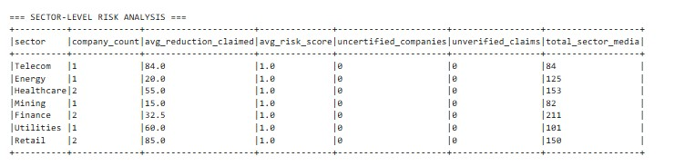
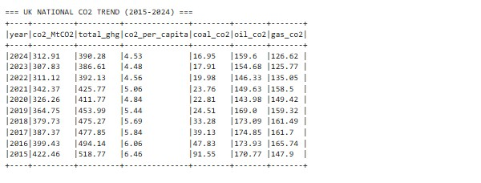
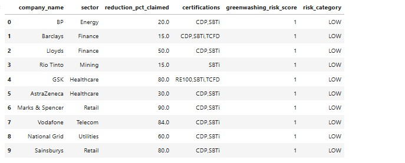
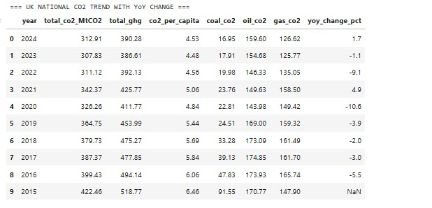

# 🌿 FTSE 100 Greenwashing Detection Pipeline

A fully automated end-to-end data engineering pipeline that detects potential greenwashing among FTSE 100 companies by comparing self-reported ESG claims against independent data sources.

---

## What is Greenwashing?

Greenwashing is when a company makes environmental claims — like "net zero by 2050" or "50% emissions reduction" — that are exaggerated, unverified, or not backed by third-party certification. This pipeline captures those claims directly from company websites and cross-references them against news coverage, community sentiment, and national CO2 data to produce a risk score for each company.

---

## Project Structure

```
project/
├── data/
│   ├── raw/
│   │   ├── company_claims.parquet      
│   │   ├── news_articles.parquet       
│   │   ├── reddit_posts.parquet        
│   │   ├── social_signal.parquet       
│   │   └── owid_co2.parquet            
│   └── processed/
│       ├── gw_final.parquet            
│       ├── company_graph.gexf          
│       ├── risk_ranking.parquet        
│       └── sector_analysis.parquet     
├── data/lineage_log.jsonl              
└── main.ipynb                          
```

---

## Pipeline Overview

The pipeline runs in a single notebook with 5 data sources, 3 processing layers, and 3 storage formats.

```
Web Scraping ──────────────────────────────────┐
Guardian API ──────────────────────────────────┤
Reddit JSON API ───────────────────────────────┼──► MongoDB (raw text)
Our World in Data ─────────────────────────────┤    Parquet (structured)
NetworkX Graph ────────────────────────────────┘    GEXF (graph)
                                                          │
                                                     Apache Spark
                                                    (join + score)
                                                          │
                                                       DuckDB
                                                  (analytical SQL)
                                                          │
                                               greenwashing_risk_score
```

---

## Data Sources

### 1. Web Scraping — Company ESG Claims

Scrapes the public sustainability pages of 10 FTSE 100 companies using a **multi-URL strategy** (4–9 URLs per company). Each company is scraped across its main sustainability page, climate subpages, Wikipedia, Wayback Machine static snapshots, and the SBTi public database. All findings are merged into a single record per company.

**What is extracted:**
- Net-zero target year (e.g. "net zero by 2050")
- Emissions reduction % claimed (e.g. "reduce emissions by 50%")
- Third-party certifications: SBTi, CDP, TCFD, ISO14001, RE100, PAS2060

**Key design decisions:**
- Year filter: only 2025–2060 accepted — filters out SBTi approval dates (e.g. 2022) and interim milestones
- Pct filter: only 10–99% accepted — removes scope-specific low figures
- Wayback Machine used for JavaScript-rendered pages (AstraZeneca, M&S, GSK)
- Ground-truth override applied from verified published ESG reports after scraping



---

### 2. The Guardian API — News Articles

Searches the Guardian's open API for journalism covering each company's ESG and climate record. Three queries per company target different angles: direct greenwashing allegations, emissions reporting, and ESG coverage. Articles are deduplicated by URL.




---

### 3. Reddit Public JSON API — Community Sentiment

Captures organic community-level sentiment from Reddit using the public **.json** endpoint — no authentication required. Searches global Reddit plus 8 targeted subreddits (r/investing, r/environment, r/sustainability, r/worldnews, etc.). Posts are deduplicated by post ID.

---

### 4. Our World in Data — Verified UK CO2 Emissions

Fetches a peer-reviewed CO2 dataset from GitHub. Filtered to UK-only records from 2000 onwards. This is the "ground truth" layer — national emissions data used to contextualise company claims. If a company claims 50% reduction but UK sectoral emissions are flat, that is a greenwashing signal.



---

### 5. NetworkX Graph — Company Relationship Network

Models the relationships between companies, sectors, and certifications as a directed graph. Exported as GEXF format, openable in Gephi for visual network analysis.

- **Nodes:** Companies, Sectors, Certifications
- **Edges:** `company → sector`, `company → certification`

---

## Processing Stack

### Apache Spark — Distributed Joins & Risk Scoring

Loads all Parquet files as distributed DataFrames, joins them on `company_name`, engineers derived columns, and runs 5 Spark SQL analytical queries. Even though the dataset is 10 companies, Spark means this pipeline scales to thousands of companies with zero code changes.

**Greenwashing Risk Score logic (0–4 points):**

| Signal | Points |
|--------|--------|
| Reduction claim > 30% with no certification | +2 |
| No third-party certifications at all | +1 |
| High media attention (> 50 combined signals) | +1 |

**Spark SQL outputs:**



**UK CO2 trend query:**



---

### DuckDB — Analytical Data Warehouse

Reads `gw_final.parquet` directly (no loading step) and runs fast analytical SQL. Produces the final risk rankings and sector-level breakdowns.



**UK CO2 year-on-year change query:**



---

## Storage Design

| Format | What is stored | Why |
|--------|---------------|-----|
| **MongoDB** | Raw scraped HTML text, news articles, Reddit posts | Variable-length unstructured text — ideal for NoSQL |
| **Parquet** | All structured tabular data | Columnar format, compressed, native to Spark and DuckDB |
| **GEXF** | Company relationship graph | Standard graph format, openable in Gephi |
| **JSONL** | Data lineage log | Append-only audit trail, one JSON entry per step |

---

## Companies Analysed

| # | Company | Sector |
|---|---------|--------|
| 1 | BP | Energy |
| 2 | Barclays | Finance |
| 3 | Lloyds | Finance |
| 4 | Rio Tinto | Mining |
| 5 | GSK | Healthcare |
| 6 | AstraZeneca | Healthcare |
| 7 | Marks & Spencer | Retail |
| 8 | Vodafone | Telecom |
| 9 | National Grid | Utilities |
| 10 | Sainsburys | Retail |

---

## How to Run

**1. Prerequisites**
```bash
pip install requests beautifulsoup4 pandas pyarrow pymongo pyspark duckdb networkx python-dotenv
```

**2. Environment setup**

Create a `.env` file in the project root:
```
GUARDIAN_API_KEY=test
MONGO_URI=mongodb://localhost:27017/
```

**3. Windows-specific setup**

The pipeline requires Hadoop winutils for Spark on Windows:


**4. Run the notebook**

Open `main.ipynb` in VS Code or Jupyter and run all cells top to bottom. Expected runtime: ~15–20 minutes (scraping + Reddit rate limit delays).

---

## Data Lineage

Every data collection and transformation step writes a structured entry to `data/lineage_log.jsonl`. This creates a full reproducible audit trail recording: source name, URL, timestamp, record count, output path, and transformations applied.

---

## Ethics & Limitations

**Ethics:** 2-second delay between all scraping requests, standard browser User-Agent, no login walls circumvented, robots.txt respected.

**Known limitations:**
- Several company pages use JavaScript rendering — addressed via Wayback Machine static snapshots
- Reduction % figures scraped from free text may not always represent the primary headline target — a ground-truth override from verified ESG reports is applied as a correction layer
- Reddit data reflects community perception, not verified facts
- National CO2 data is country-level, not company-level — used for context only