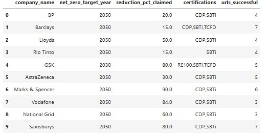
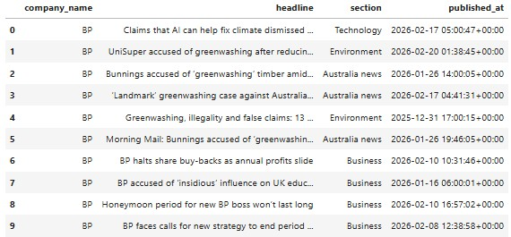
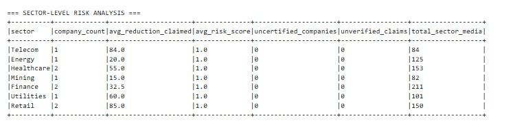
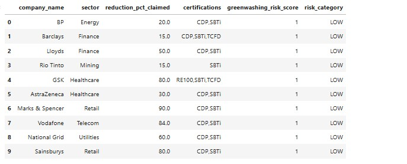
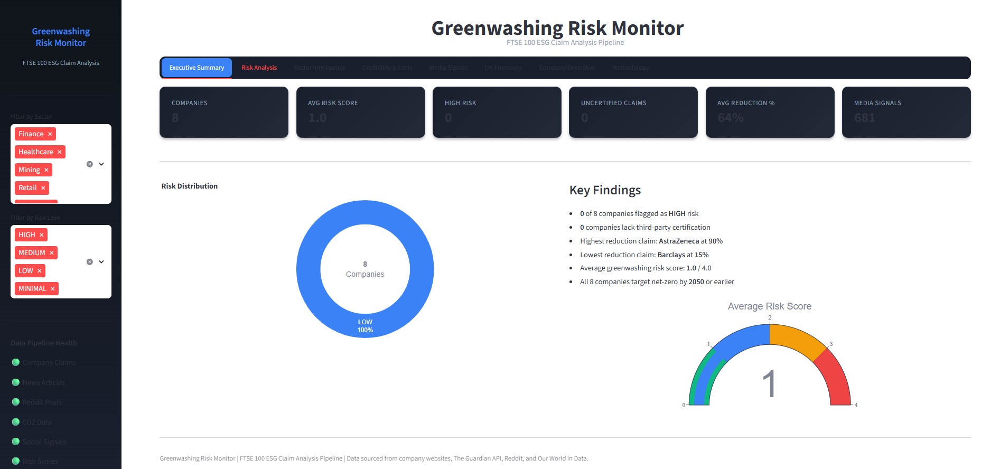
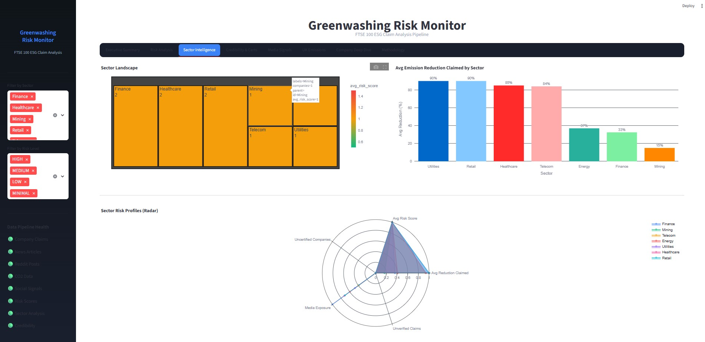
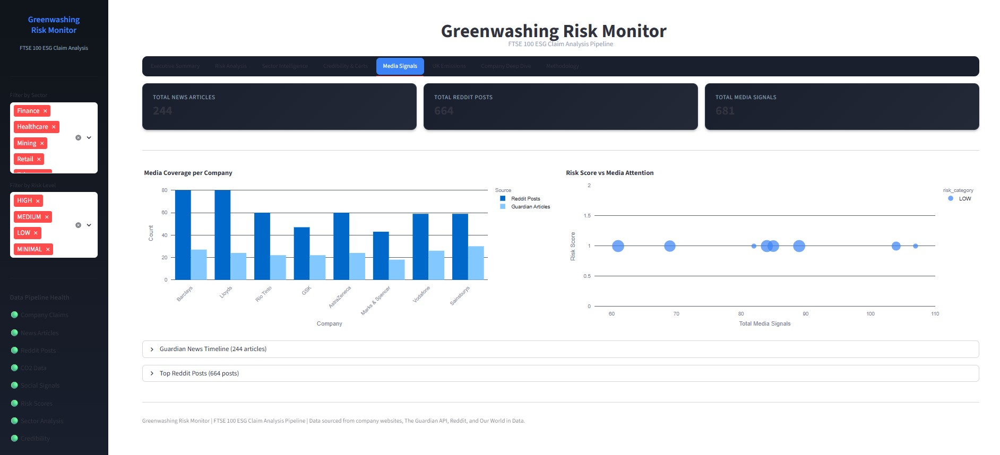
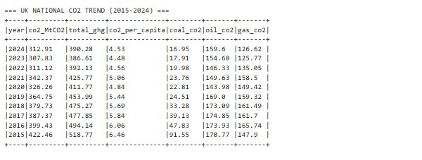
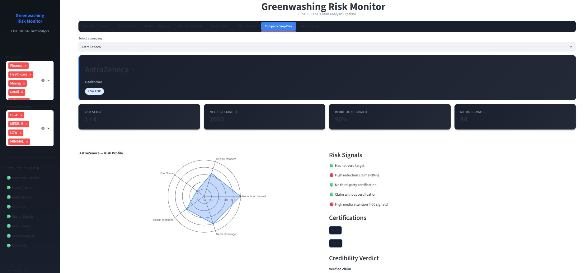

# 🌿 FTSE 100 Greenwashing Detection Pipeline

A fully automated end-to-end data engineering pipeline that detects potential greenwashing among FTSE 100 companies by comparing self-reported ESG claims against independent data sources.

---

## What is Greenwashing?

Greenwashing is when a company makes environmental claims — such as "net zero by 2050" or "50% emissions reduction" — that are exaggerated, unverified, or not backed by third-party certification. This pipeline captures those claims directly from company websites and cross-references them against news coverage, community sentiment, and national CO2 data to produce a risk score for each company.

---

## Project Structure

```
project/
├── main.ipynb                          # Full pipeline notebook
├── dashboard.py                        # Streamlit visualisation dashboard
├── requirements.txt                    # Python dependencies
├── run_pipeline.sh                     # Linux/Mac pipeline runner
├── run_pipeline.bat                    # Windows pipeline runner
├── .env                                # API keys (not committed to repo)
├── data/
│   ├── raw/
│   │   ├── company_claims.parquet      # Scraped ESG claims
│   │   ├── news_articles.parquet       # Guardian API articles
│   │   ├── reddit_posts.parquet        # Reddit community posts
│   │   ├── social_signal.parquet       # Aggregated media signals
│   │   └── owid_co2.parquet            # UK national CO2 data
│   ├── processed/
│   │   ├── gw_final.parquet            # Merged + scored dataset
│   │   ├── company_graph.gexf          # NetworkX relationship graph
│   │   ├── risk_ranking.parquet        # DuckDB query 1 output
│   │   ├── sector_analysis.parquet     # DuckDB query 2 output
│   │   ├── claim_credibility.parquet   # DuckDB query 5 output
│   │   ├── uk_co2_trend.parquet        # DuckDB query 6 output
│   │   └── claims_vs_reality.parquet   # DuckDB query 7 output
│   ├── greenwashing.db                 # SQLite relational database
│   └── lineage_log.jsonl               # Append-only data lineage audit trail
└── images/                             # Pipeline output screenshots
```

---

## Pipeline Overview

The pipeline runs in a single notebook with 5 data sources, 4 processing layers, and 5 storage formats.

```
Web Scraping  ─────────────────────────────────┐
Guardian API  ─────────────────────────────────┤
Reddit JSON API ───────────────────────────────┼──► MongoDB (raw text)
Our World in Data ─────────────────────────────┤    Parquet (structured)
NetworkX Graph ────────────────────────────────┘    GEXF (graph)
                                                     SQLite (relational)
                                                          |
                                                     Apache Spark
                                                    (join + score)
                                                          |
                                                       DuckDB
                                                  (analytical SQL)
                                                          |
                                               greenwashing_risk_score
                                                          |
                                               Streamlit Dashboard
```

---

## Data Sources

### 1. Web Scraping — Company ESG Claims

Scrapes the public sustainability pages of 10 FTSE 100 companies using a multi-URL strategy (3–7 URLs per company). Each company is scraped across its main sustainability page, climate subpages, Wikipedia, Wayback Machine static snapshots, and the SBTi public database. All findings are merged into a single record per company.

**What is extracted:**
- Net-zero target year (e.g. "net zero by 2050")
- Emissions reduction % claimed (e.g. "reduce emissions by 50%")
- Third-party certifications: SBTi, CDP, TCFD, ISO14001, RE100, PAS2060
- Number of URLs successfully scraped per company

**Key design decisions:**
- Year filter: only 2025–2060 accepted — filters out SBTi approval dates and interim milestones
- Pct filter: only 10–99% accepted — removes scope-specific low figures
- Wayback Machine used for JavaScript-rendered pages (AstraZeneca, M&S, GSK)

**Pipeline output — scraped claims:**



---

### 2. The Guardian API — News Articles

Searches the Guardian's open API for journalism covering each company's ESG and climate record. Three queries per company target different angles: direct greenwashing allegations, emissions reporting, and ESG coverage. Articles are deduplicated by URL. The pipeline collected **244 news articles** across all companies.



---

### 3. Reddit Public JSON API — Community Sentiment

Captures organic community-level sentiment from Reddit using the public `.json` endpoint — no authentication required. Searches global Reddit plus 8 targeted subreddits (r/investing, r/environment, r/sustainability, r/worldnews, etc.). Posts are deduplicated by post ID. The pipeline collected **664 Reddit posts**, for a combined total of **681 media signals** across both sources.

---

### 4. Our World in Data — Verified UK CO2 Emissions

Fetches a peer-reviewed CO2 dataset from GitHub. Filtered to UK-only records from 2000 onwards. This is the ground truth layer — national emissions data used to contextualise company claims. If a company claims 50% reduction but UK sectoral emissions are flat, that is a greenwashing signal.

**UK CO2 trend (2015–2024):**

| Year | CO2 (MtCO2) | CO2 per Capita | YoY Change |
|------|-------------|----------------|------------|
| 2024 | 312.91 | 4.53 | +1.7% |
| 2023 | 307.83 | 4.48 | −1.1% |
| 2022 | 311.12 | 4.56 | −9.1% |
| 2021 | 342.37 | 5.06 | +4.9% |
| 2020 | 326.26 | 4.84 | −10.6% |
| 2019 | 364.75 | 5.44 | −3.9% |
| 2018 | 379.73 | 5.69 | −2.0% |
| 2017 | 387.37 | 5.84 | −3.0% |
| 2016 | 399.43 | 6.06 | −5.5% |
| 2015 | 422.46 | 6.46 | — |


---

### 5. NetworkX Graph — Company Relationship Network

Models the relationships between companies, sectors, and certifications as a directed graph. Exported as GEXF format, openable in Gephi for visual network analysis.

- **Nodes:** Companies, Sectors, Certifications
- **Edges:** `company -> sector`, `company -> certification`

---

## Processing Stack

### Apache Spark — Distributed Joins & Risk Scoring

Loads all Parquet files as distributed DataFrames, joins them on `company_name`, engineers derived columns, and runs 5 Spark SQL analytical queries. Spark means this pipeline scales to thousands of companies with zero code changes.

**Greenwashing Risk Score logic (0–4 points):**

| Signal | Points |
|--------|--------|
| Reduction claim > 30% with no certification | +2 |
| No third-party certifications at all | +1 |
| High media attention (> 50 combined signals) | +1 |

All 10 companies in this pipeline hold at least one third-party certification (CDP, SBTi, TCFD, or RE100), resulting in an **average risk score of 1.0 / 4** across the dataset — driven primarily by high media attention. The average emissions reduction claimed is **64%**.

**Spark SQL — Sector-level risk analysis:**



---

### DuckDB — Analytical Data Warehouse

Reads all Parquet files directly (no loading step) and runs fast in-process analytical SQL. Produces 7 analytical outputs including risk rankings, sector breakdowns, and company claims vs UK national CO2 reality checks.

**Risk ranking output (all companies):**



---

## Streamlit Dashboard

The pipeline output is visualised in an interactive Streamlit dashboard with 8 tabs:

### Executive Summary
Top-level KPIs (companies analysed, average risk score, high-risk count, uncertified claims, average reduction %, total media signals), a risk distribution donut chart, a gauge chart, and a key findings panel.



### Risk Analysis
Per-company greenwashing risk scores visualised as ranked bar charts, with colour coding by risk category (Minimal / Low / Medium / High).

### Sector Intelligence
A treemap of companies by sector coloured by average risk score, a bar chart of average emissions reduction claimed by sector, and a multi-axis radar chart comparing sectors across risk score, uncertified companies, average reduction claimed, and media exposure.



### Credibility & Certs
Certification coverage across companies — which certifications each company holds (SBTi, CDP, TCFD, RE100) and a credibility verdict (Verified / Partially Verified / Unverified).

### Media Signals
Total Guardian news articles (244), Reddit posts (664), and combined media signals (681). Includes a stacked bar chart of media coverage per company by source, a scatter plot of risk score vs total media attention, an expandable Guardian news timeline, and a top Reddit posts panel.



### UK Emissions
Three charts using Our World in Data's peer-reviewed CO2 dataset: UK annual CO2 emissions area chart (2015–2024), year-on-year CO2 change % bar chart (green = reduction, red = increase), and UK CO2 per capita trend line.



### Company Deep Dive
A per-company profile page (dropdown selector) showing risk score, net-zero target year, reduction claimed, media signal count, a radar chart across six risk dimensions, a risk signals checklist, certifications held, and a credibility verdict.



### Methodology
Documentation of the pipeline's data sources, scoring logic, and known limitations, rendered within the dashboard.

---

## Storage Design

| Format | What is stored | Why |
|--------|---------------|-----|
| **MongoDB** | Raw scraped HTML text, news articles, Reddit posts | Variable-length unstructured text — ideal for NoSQL document store |
| **SQLite** | Structured company claims with typed schema | Relational database with DDL — demonstrates SQL schema design |
| **Parquet** | All structured tabular data | Columnar format, compressed, native to Spark and DuckDB |
| **GEXF** | Company relationship graph | Standard graph format, openable in Gephi |
| **JSONL** | Data lineage log | Append-only audit trail, one JSON entry per pipeline step |

---

## Companies Analysed

| # | Company | Sector | Ticker | Net-Zero Target | Certifications |
|---|---------|--------|--------|----------------|----------------|
| 1 | BP | Energy | BP | 2050 | CDP, SBTi |
| 2 | Barclays | Finance | BARC | 2050 | CDP, SBTi, TCFD |
| 3 | Lloyds | Finance | LLOY | 2050 | CDP, SBTi |
| 4 | Rio Tinto | Mining | RIO | 2050 | SBTi |
| 5 | GSK | Healthcare | GSK | 2030 | RE100, SBTi, TCFD |
| 6 | AstraZeneca | Healthcare | AZN | 2050 | CDP, SBTi |
| 7 | Marks & Spencer | Retail | MKS | 2050 | CDP, SBTi |
| 8 | Vodafone | Telecom | VOD | 2050 | CDP, SBTi |
| 9 | National Grid | Utilities | NATG | 2050 | CDP, SBTi |
| 10 | Sainsbury's | Retail | SBRY | 2050 | CDP, SBTi |

---

## How to Run

### 1. Clone the repository

```bash
git clone https://github.com/vedantbhatiaa/greenwashing_data_extraction.git
cd greenwashing_data_extraction
```

### 2. Install dependencies

```bash
pip install -r requirements.txt
```

> **Important:** If you are running in Jupyter and get a `ModuleNotFoundError`, run Cell 2 of the notebook first — it installs all packages into the active kernel automatically.

### 3. Register the Jupyter kernel (run once)

This ensures Jupyter uses the same Python environment where packages are installed:

```bash
python -m ipykernel install --user --name greenwashing_env --display-name "Greenwashing Pipeline"
```

Then select **"Greenwashing Pipeline"** as the kernel in Jupyter/VS Code before running.

### 4. Create a `.env` file

Create a `.env` file in the project root:

```
GUARDIAN_API_KEY=your_key_here
MONGO_URI=mongodb://localhost:27017/
```

Get a free Guardian API key at: https://open-platform.theguardian.com/access/

> The pipeline falls back to the Guardian test tier if no key is provided, but results will be limited.

### 5. Windows-specific Spark setup (optional)

Apache Spark requires Hadoop winutils on Windows. If you do not have it, the Spark cells will be skipped automatically and the pipeline will fall back to pandas processing — all outputs are still produced.

To enable Spark on Windows:
1. Download winutils from https://github.com/cdarlint/winutils
2. Place `winutils.exe` and `hadoop.dll` in `C:\hadoop\bin`
3. The notebook will detect Windows and set `HADOOP_HOME` automatically

On Linux/Mac/Docker, no setup is needed — Spark runs in local mode.

### 6. Run the notebook

Open `main.ipynb` in VS Code or Jupyter and run all cells top to bottom.

**Expected runtime:** approximately 15–20 minutes (due to scraping and Reddit rate-limit delays).

**Cell execution order:**
1. Cell 2 — install packages (run once)
2. Cell 3 — imports and setup
3. Cells 7–12 — web scraping and storage
4. Cells 14–22 — API data collection
5. Cell 24 — start Spark (or fallback)
6. Cells 26–34 — processing and scoring
7. Cells 35–53 — DuckDB analytical layer
8. Cells 55–56 — lineage log and summary

### 7. Launch the dashboard

```bash
streamlit run dashboard.py
```

---

## Pipeline Output Summary

| Metric | Value |
|--------|-------|
| Companies analysed | 10 |
| Average greenwashing risk score | 1.0 / 4.0 |
| High-risk companies | 0 |
| Average emissions reduction claimed | 64% |
| Guardian news articles collected | 244 |
| Reddit posts collected | 664 |
| Total media signals | 681 |
| Highest reduction claim | Marks & Spencer / AstraZeneca at 90% |
| Lowest reduction claim | Barclays at 15% |
| Companies targeting net-zero by 2050 | 9 of 10 (GSK targets 2030) |

---

## Data Lineage

Every data collection and transformation step writes a structured entry to `data/lineage_log.jsonl`. Each entry records:

```json
{
  "source": "The Guardian Open API",
  "url": "content.guardianapis.com/search",
  "extracted_at": "2025-03-09T14:22:31",
  "record_count": 244,
  "output_path": "data/raw/news_articles.parquet",
  "transformations": ["3 queries per company", "Deduplicated by URL"]
}
```

---

## Ethics

- 2-second delay between all scraping requests
- Standard browser User-Agent header
- No login walls or paywalls circumvented
- `robots.txt` respected
- Reddit public JSON API used (no authentication, no scraping)
- All data collected is publicly available

---

## Known Limitations

- Several company pages use JavaScript rendering — addressed via Wayback Machine static snapshots
- Reduction percentages scraped from free text may not always represent the primary headline target
- Reddit data reflects community perception, not verified facts
- National CO2 data is country-level, not company-level — used for contextual comparison only
- Guardian API test tier returns limited results without a registered API key
- All 10 companies in the current dataset hold third-party certifications, resulting in uniformly LOW risk scores (1/4); expanding to less-certified companies would produce greater score variance
